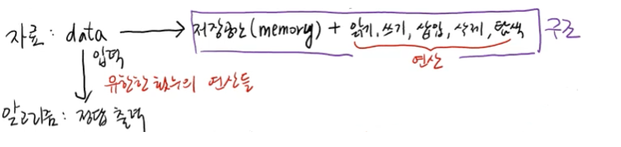
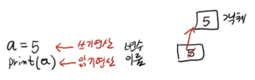
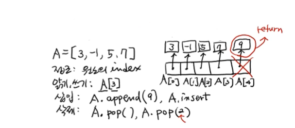
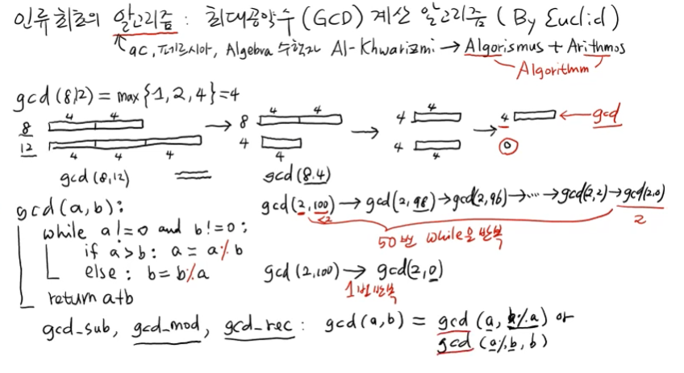

# Week1_윤선영_자료구조와 알고리즘

## <강의 목차 소개>

- 자료구조와 알고리즘 : 가상머신, 언어, 코드, 알고리즘 / 자료구조 복잡도, Big-O기호

- Arry(List) : Stack, Queue, Deque

- Linked List(한방향, 양방향)

- Hash Table(*) : 현실적으로 가장 많이 사용하는 자료구조! 해시함수, 해시 충돌 해결방법 

- Tree
  
  - Priority Queue : Heap + Heap Sort
  
  - 이진트리 : 순회
  
  - 이진탐색트리 : 삽입, 삭제 등
  
  - 균형이진탐색트리 : AvL, 2-3-4, Red-Black, Splay

- Graph
  
  - 가장 일반적인 자료구조
  
  - 표현법, 순회법(DFS, BFS)
  
  - 최단경로 알고리즘(Bellman-Ford, Dijkstra algorithms)

## <자료구조와 알고리즘>



### 자료구조(Data Structure)

* 자료를 담는 구조
- 자료 : data → <mark>저장 공간(memory) + 읽기, 쓰기, 삽입, 삭제, 탐색(연산)</mark> < 구조

### 알고리즘(Algorithm)

-  자료구조에 담긴 데이터를 가공해서 유한한 횟수의 연산을 수행, 어떤 문제의 정답을 출력하는 것

- 자료구조와 알고리즘은 바늘과 실 같은 관계이다.

### 자료구조 예

##### 변수 (variable)

```python
a = 5            # 쓰기 연산
print(a)         # 읽기 연산
```



* 접근 : 변수의 이름

* 파이썬에서는 a라는 변수가 있을 때 여기에 5라는 값이 실제로 저장되는 것이 아니라, 5가 저장되어있는 주소가 a라는 변수에 저장됨! 5가 들어있는 객체의 주소가 a에 담기게 되는 것!

##### 배열 (array)

```python
lst = [3, -1, 5, 7]
print(lst[3])      # 읽기, 쓰기 연산 : 출력결과 7
lst.append(9)      # 삽입 연산(오른쪽 끝) : lst = [3, -1, 5, 7, 9] 
lst.insert(0, 2)   # 삽입 연산(0번째 자리에 2 삽입) : lst = [2, 3, -1, 5, 7, 9]
lst.pop()          # 삭제 연산(오른쪽 끝 원소 삭제) : 출력결과 2, lst = [2, 3, -1, 5, 7]
lst.pop(2)         # 삭제 연산(2번 index 원소 삭제) : 출력결과 -1, lst = [2, 3, 5, 7]

```



- 접근 : 각 원소의 index
  
  ⚠ 리스트의 index는 0번부터 시작함!

- 읽기/쓰기 
  
  - lst[x] : 리스트의 x번째 값

- 삽입
  
  - lst.append(x) : 리스트의 오른쪽 끝에 x 추가
  
  - lst.insert(x, y) : 리스트의 x번째 위치(인덱스)에 y 삽입

- 삭제
  
  - lst.pop() : 리스트의 오른쪽 끝에 있는 원소 return후 삭제시킴
  
  - lst.pop(x) : 리스트의 x번째 원소를 return하고 삭제시킴

- 파이썬에서는 리스트! (list)

- A[0]은 3객체, A[1]은 -1객체, A[2]는 5객체, A[3]은 7객체를 가리키게 됨

### 인류 최초의 알고리즘 : 최대공약수(GCD) 계산 알고리즘(유클리드)



- gcd(8, 12) = max(1, 2, 4) = 4

- gcd(a, b) : gcd_sub, gcd_mod, gcd_rec(재귀)
  
  ```python
  while a != 0 and b!= 0:
      if a > b : a = a - b
      else : b = b - a
  return a + b
  ```
  
  ```python
  while a != 0 and b!= 0:
      if a > b : a = a % b
      else : b = b % a
  return a + b
  ```
